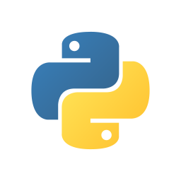
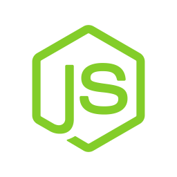
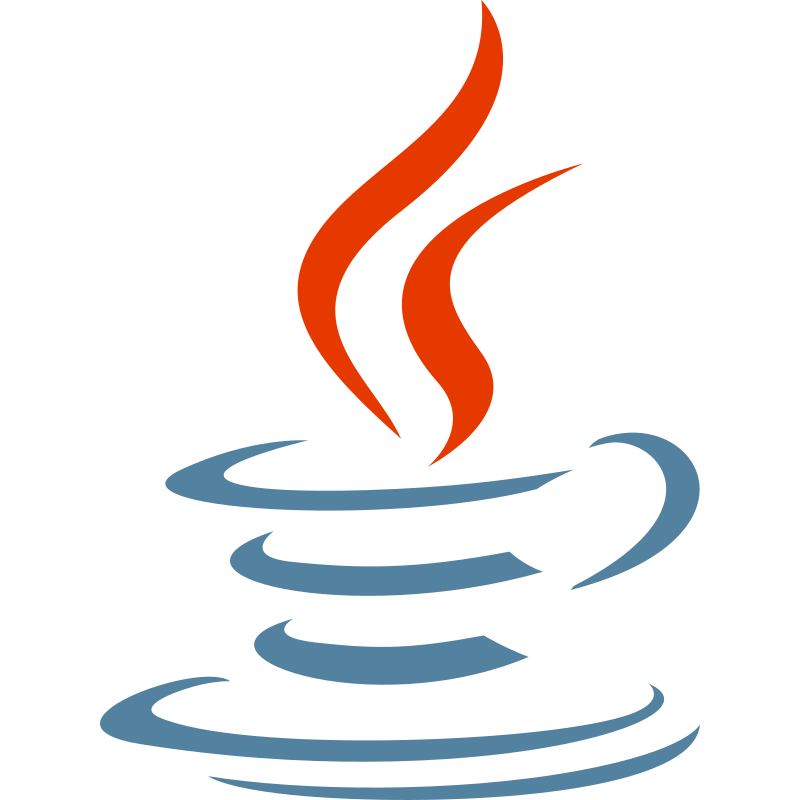
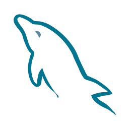
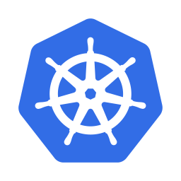
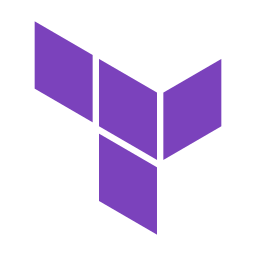
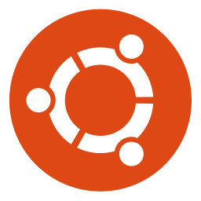
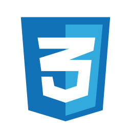
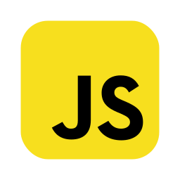

**[Read this in English](./README_en.md)**

# **Olá, eu sou o Luis Felipe!** 👋

## 🚀 Desenvolvedor de Software

Com **2 anos de experiência** na área de tecnologia, sou um desenvolvedor fullstack focado em criar soluções escaláveis e de alta performance. Minha principal área de atuação é o backend, onde utilizo **Python** e **Django** para desenvolver sistemas bem arquitetados e eficientes, sempre com uma visão de **entrega de valor** ao negócio.

Além disso, tenho experiência no desenvolvimento frontend utilizando **React.js**, criando interfaces modernas e intuitivas, o que me permite entregar produtos que aliam **eficiência no backend** com uma **excelente experiência de usuário**.

Estou constantemente aprimorando minhas habilidades como engenheiro backend e investindo no **aprendizado de Cloud Computing**, especialmente **AWS**, com o objetivo de obter minha primeira **certificação** e expandir minhas capacidades em **arquiteturas de nuvem**.

Sou movido pela **curiosidade** e pelo **desejo de explorar novas tecnologias**, com interesses que vão além do backend e cloud, como **Cibersegurança** e **Inteligência Artificial**, áreas que acompanho de perto para me manter atualizado.

### 🌟 O que me move

- 🎯 **Interesses:** Backend, Arquitetura de Sistemas, Cloud Computing (AWS), IA
- 📚 **Em Aprendizado:** AWS, Docker, Kubernetes, MongoDB, Arquitetura de Software
- ❤️ **Paixões:** Networking, troca de conhecimento, inovação e projetos desafiadores

### 📫 Vamos conversar?

- 🌍 Uberlândia, MG
- ✉️ Me envie um e-mail: <luisftomasprado@gmail.com>
- 🔗 Vamos se conectar: [LinkedIn](https://www.linkedin.com/in/lsstomas)

## ⚙️ Habilidades

### Back-end

### DevOps & Cloud

### Front-end

