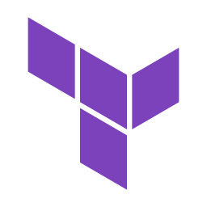
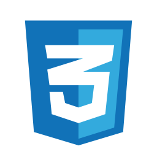
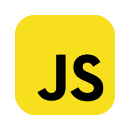

**[Leia isso em português](./README.md)**

# **Hello, I'm Luis Felipe!** 👋

## 🚀 Software Developer

With **2 years of experience** in the tech industry, I’m a fullstack developer focused on building scalable and high-performance solutions. My main area of expertise is backend development, where I use **Python** and **Django** to create well-architected and efficient systems, always with a focus on **delivering value** to the business.

In addition, I have experience in frontend development using **React.js**, creating modern and intuitive interfaces, which allows me to deliver products that combine **backend efficiency** with an **excellent user experience**.

I am constantly improving my skills as a backend engineer and investing in **Cloud Computing**, particularly **AWS**, aiming to achieve my first **certification** and expand my knowledge in **cloud architectures**.

Driven by **curiosity** and a **desire to explore new technologies**, my interests go beyond backend and cloud, including areas like **Cybersecurity** and **Artificial Intelligence**, which I closely follow to stay up to date.

### 🌟 What Drives Me

- 🎯 **Interests:** Backend, System Architecture, Cloud Computing (AWS), AI
- 📚 **Currently Learning:** AWS, Docker, Kubernetes, MongoDB, Software Architecture
- ❤️ **Passions:** Networking, knowledge sharing, innovation, and challenging projects

### 📫 Let’s Get in Touch!

- 🌍 Uberlândia, MG
- ✉️ Send me an e-mail: <luisftomasprado@gmail.com>
- 🔗 Let's connect: [LinkedIn](https://www.linkedin.com/in/lsstomas)

## ⚙️ Skills

### Back-end

### DevOps & Cloud

### Front-end

